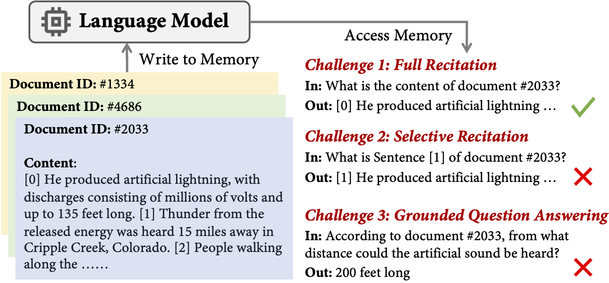

# Beyond Memorization: The Challenge of Random Memory Access in Language Models

This repo contains the code for reproducing experiments in our paper, Beyond Memorization: The Challenge of Random Memory Access in Language Models. 

In our study, we reveal that language models (GPT2) are able to sequentially access their parametric memory while encountering challenges in randomly accessing memorized content.



The central idea is that the model can memorize any content, but cannot access the memory in a random manner. We verify that the limited random access
ability has implications on the real open-domain question answering: the model may fail to answer an question simply because it cannot access an answer stored in the middle of a memorized passage.

## Requirements
Please create an environment using `pip` and `requirements.txt` file.

```pip install -r requirements.txt ```

## Data 
All the data for the experiments are hosted on Huggingface hub. You can directly use them without downloading. 

## Experiments
The experiments are divided into the four parts:
1. Full recitation: Asking the model to recite the full passage given an passage ID
2. Selective recitation: Asking the model to recite a sentence from the passage give a passage ID
3. Grounded QA: Given an ID and a question, asking the model to answer the question. 
4. Open-domain QA: Given a question, asking the model to answer the question. The model may be trained on the passages. 

## Running the experiments
The scripts for each of the experiments can be found in their respective folders.
For instance, if you wish to run the full recitation experiments on gpt2-large, you should be at the project root folder, and run:

``bash full_recitation/run.sh gpt2-large``

[//]: # (To run the experiments, you can simply use:)

[//]: # (```bash run_experiments.sh <experiment_name>``` where the experiment name is in `full_recite`, `selective_recite`, `grounded_qa`, `open_domain_qa`)
